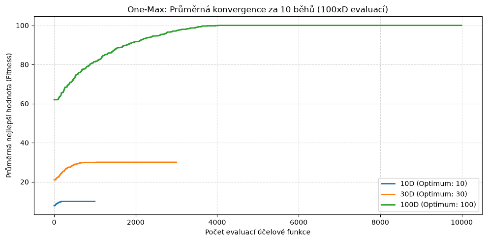
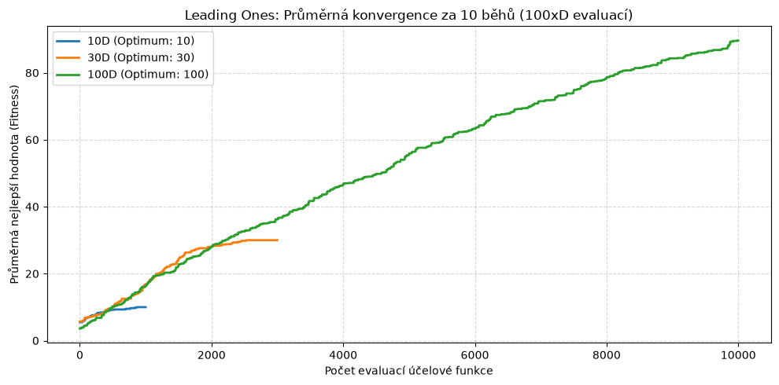

# **Úloha 1: Genetický algoritmus - binární problém**
> Kompletní jupyter notebook včetně kódu [zde](./genetic_algorithm.ipynb).

Genetický algoritmus je stochastická optimalizační metoda inspirovaná Darwinovou teorií přirozeného výběru a biologickou evolucí. Namísto deterministického procházení stavového prostoru udržuje populaci potenciálních řešení, která se iterativně vyvíjí v čase pomocí základních evolučních mechanismů:

* **Reprezentace jedince:** V této úloze je jedinec reprezentován jako binární řetězec pevné délky $D$ (složený z bitů $0$ a $1$).
* **Evaluace jedince (Fitness)**: Každý jedinec je ohodnocen účelovou funkcí, která kvantifikuje jeho kvalitu v kontextu řešeného problému.
* **Elitismus:** Pevný zlomek nejlepších jedinců je beze změny přenesen přímo do nové generace, což garantuje monotónní neklesající kvalitu nejlepšího nalezeného řešení v čase.
* **Selekce:** Preferenční výběr rodičů na základě jejich zdatnosti (pomocí ruletové nebo pořadové selekce). Vyšší zdatnost znamená větší šanci předat genetickou informaci dalším generacím.
* **Křížení (Crossover):** Výměna bloků bitů mezi dvěma vybranými rodiči za účelem kombinace perspektivních jedinců.
* **Mutace:** Náhodná inverze bitů s malou pravděpodobností. Slouží k udržení genetické diverzity a brání uváznutí v lokálních optimech.

Cílem tohoto úkolu je genetický algoritmus implementovat a poté prozkoumat dynamiku konvergence a vliv nastavení hyperparametrů na dvou odlišných binárních testovacích funkcích:
* **One-Max:** Lineární, plně separabilní problém se stabilním gradientem.
* **Leading Ones:** Nelineární problém se silnou epistatickou vazbou (bity za první nulou nenesou žádnou informaci).

Obě úlohy budou řešeny pro dimenze 10D, 30D a 100D s omezeným rozpočtem $100 \times D$ evaluací účelové funkce, přičemž výsledky budou vyhodnoceny napříč 10 nezávislými běhy.

## **Genetické operátory (selekce, křížení, mutace)**

* **Selekce rodičů:**
  * **Ruletová selekce:** Pravděpodobnost výběru je přímo úměrná absolutní hodnotě fitness. Může vést k předčasné konvergenci, pokud jeden jedinec výrazně převyšuje ostatní, nebo naopak ke ztrátě selekčního tlaku v závěru evoluce, kdy mají všichni jedinci téměř stejnou zdatnost.
  * **Pořadová selekce:** Jedinci jsou seřazeni a pravděpodobnost výběru závisí pouze na jejich relativním pořadí (ranku), nikoliv na absolutní hodnotě zdatnosti. Udržuje stabilní selekční tlak napříč všemi generacemi.

* **Jednobodové křížení:**
  * Náhodně zvolí bod řezu uvnitř binárního řetězce (s garancí alespoň jednoho bitu z každé strany).
  * Výměnou odpovídajících částí mezi dvěma rodiči vznikají dva noví potomci.

* **Jednobodová bitová mutace:**
  * Prochází binární řetězec bit po bitu a s určitou pravděpodobností (typicky 0,5 - 1 %) provede inverzi bitu (0 $\to$ 1, 1 $\to$ 0).
  * Umožňuje prozkoumávat nové oblasti stavového prostoru a navracet ztracenou genetickou diverzitu.

## **Popis účelových (fitness) funkcí**

* **One-Max problém:**
  * Spočívá v prostém součtu všech jedniček v binárním řetězci.
  * Jde o aditivní, lineární problém – každá přidaná jednička přímočaře zvyšuje zdatnost jedince bez ohledu na její pozici.
  * Globální optimum pro dimenzi *D* je hodnota *D*.

* **Leading Ones problém:**
  * Měří délku souvislé řady jedniček začínající od prvního bitu zleva (až k první nalezené nule).
  * Reprezentuje nelineární problém – bity za první nulou nemají na fitness žádný vliv, dokud není tato nula opravena na jedničku.
  * Globální optimum pro dimenzi *D* je rovněž hodnota *D*.

## **Výsledky experimentů**

###  **One-Max**

| Dimenze | Počet evaluací | Nejlepší výsledek | Nejhorší výsledek | Průměr | Medián | Směrodatná odchylka | Úspěšnost nalezení optima |
| :--- | :--- | :--- | :--- | :--- | :--- | :--- | :--- |
| **10D** | 1000 | 10.00 | 10.00 | 10.00 | 10.00 | 0.00 | 100.0% |
| **30D** | 3000 | 30.00 | 30.00 | 30.00 | 30.00 | 0.00 | 100.0% |
| **100D** | 10000 | 100.00 | 100.00 | 100.00 | 100.00 | 0.00 | 100.0% |

###  **Leading Ones**

| Dimenze | Počet evaluací | Nejlepší výsledek | Nejhorší výsledek | Průměr | Medián | Směrodatná odchylka | Úspěšnost nalezení optima |
| :--- | :--- | :--- | :--- | :--- | :--- | :--- | :--- |
| **10D** | 1000 | 10.00 | 10.00 | 10.00 | 10.00 | 0.00 | 100.0% |
| **30D** | 3000 | 30.00 | 30.00 | 30.00 | 30.00 | 0.00 | 100.0% |
| **100D** | 10000 | 100.00 | 72.00 | 89.60 | 89.50 | 7.89 | 20.0% |

## **Konvergenční grafy**

## **Závěr a shrnutí úkolu**

### **Srovnání úloh: One-Max vs. Leading Ones**

#### **One-Max**
* Každý bit přispívá k celkové hodnotě fitness nezávisle. Algoritmus těží ze stabilního gradientu, kdy jakákoli náhodně nalezená jednička okamžitě zvyšuje fitness.
* Díky tomu bylo dosaženo 100% úspěšnosti nalezení globálního optima ve všech zadaných dimenzích (10D, 30D i 100D)

#### **Leading Ones**
* Hodnotu fitness určuje nepřerušená řada jedniček z levé strany. Bity za první nulou nepředstavují žádnou odměnu.
* Zde byla optimalizace o dost náročnější, v dimenzi 100D jsem i přes různé nastavení hyperparametrů nedospěl k výsledku, kdy bych našel optimum ve více než 2 z 10 proběhlých nezávislých běhů.

### **Vliv hyperparametrů**

#### **Velikost populace**
* Tento hyperparametr mě nějvíce zaskočil především při nastavení u dimenze 100D u Leading Ones problému. Zatímco u One-Max úlohy jsem s rostoucí dimenzí velikost populace zvětšoval, nejlepšího výsledku u dimenze 100D u Leading Ones jsem naopak dosáhl po zmenšení velikosti populace v daném experimentu.

#### **Elitismus**
* U One-Max optimalizace mi stačilo pro dosažení optima zachovat 10 % nejlepších jedinců z předchozí generaci. 
* U Leading-Ones optimalizace musela být hodnota elitismu větší (15 - 20 %), jelikož bylo v mém zájmu ponechat co nejvíce jedinců, kteří už měli vybudovaný dlouhý prefix jedniček.

#### **Míra mutace**
* Míru mutace jsem držel na hodnotě 1 % u One-Max problému, jelikož inverze bitu především z 0 na 1 byla velice žádoucí.
* U Leading Ones jsem hodnotu tohoto parametru snížil na 0,75 % u dimenzí 10D a 100D, což mi přineslo kvalitnější výsledky. Zde si naopak myslím, že ztráta hodnoty fitness funkce za inverzi bitu v již existujícím prefixu samých jedniček nepřevyšuje možnou odměnu za prodloužení tohoto prefixu, a tudíž je nastavení pravděpodobnosti mutace na menší procentuální hodnotu tou správnou variantou.